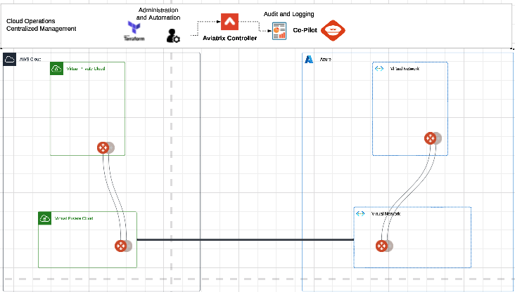

# aws-azure-transit

#### The following builds out an Aviatrix Spoke in each AWS and Azure 
#### along with 2 Aviatrix Transit Gateways. 
#### The Modules create the VPC, VNET, and all Subnets 

#### The variable file holds the what regions, subnets, image sizes and 
#### resource groups. Which can be modified.

#### For local variables and sensitive information:
#### The use of a TFVARS.TF is recomended. 

## Topology

